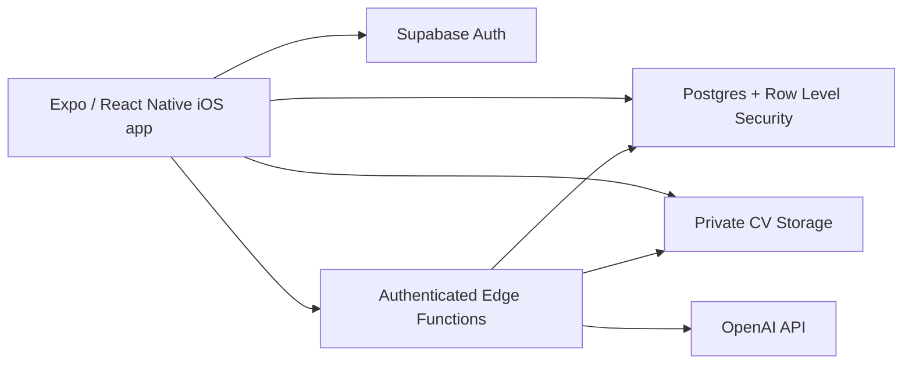

# RoleWords（职词）

> **Words for your next role.**

An iOS vocabulary and interview-preparation app for Chinese-speaking IT job seekers. RoleWords combines role-specific English learning, a custom learn/review scheduler, and CV-aware AI interview practice in one focused mobile experience.


**Status:** v0.1 in active development · iOS first

<!--
Add 3–4 portrait screenshots here when ready:
1. Learn control panel
2. Vocabulary card
3. Interview question/answer flow
4. Saved items
-->

## Why RoleWords

General English apps rarely teach the language candidates actually need for software, project-management, and AI roles. Interview tools often generate generic answers without helping users build the vocabulary to express their own experience.

RoleWords connects those two needs:

- learn English used in real IT work and interviews;
- retain it through structured reinforcement and spaced review;
- apply it to a target role using CV- and job-aware interview practice;
- save useful words, phrases, and complete sentences for later study.

## Product highlights

- **1,500 curated learning items** across Developer, Project Manager, and AI Research word books.
- **Purpose-built learning engine** with rolling groups, fair reinforcement, fatigue caps, recognition streaks, and timed review scheduling.
- **Personalised interview preparation** that uses a CV, job title, company, optional job description, and the user's own talking points.
- **AI-generated question and answer sets** with validated structure instead of unstructured model output.
- **Private, user-scoped data** using Supabase Auth, Postgres Row Level Security, private Storage, and authenticated Edge Functions.
- **Native iOS-focused experience** built with Expo Router, React Native, TypeScript, and system text-to-speech.

## Core experiences

### Role-specific vocabulary

Each word book contains 500 terms and interview expressions relevant to its role:

| Word book | Coverage |
|---|---|
| **Developer** | Programming fundamentals, frontend/backend development, APIs, databases, testing, deployment, collaboration, and technical interviews |
| **Project Manager** | Planning, scope, scheduling, risk, stakeholders, Agile delivery, governance, leadership, and interview expressions |
| **AI Research** | Machine learning, deep learning, LLMs, NLP, computer vision, RAG, agents, safety, evaluation, MLOps, and research interviews |

Learning cards can include:

- English term or phrase and IPA;
- Simplified Chinese meaning;
- part of speech and English definition;
- English example sentence and Chinese translation;
- system pronunciation through `expo-speech`;
- bookmarking and per-user learning progress.

### Learn and review engine

RoleWords separates **Learn** and **Review** instead of presenting one endless queue.

- Learn sessions introduce new words in rolling groups of 10.
- Difficult words are reinserted with a delay based on the learner's response.
- A fairness rule interleaves reinforcement without starving new content.
- Unfinished words carry into the next group rather than disappearing.
- Recognition streaks determine when an item is mastered.
- Review sessions surface up to 10 due words, most overdue first.
- Review timing adapts to the response: 10 minutes for unknown, 1 day for fuzzy, and 1/3/7 days for increasingly strong recognition.
- Unique-word and presentation caps prevent sessions from becoming exhausting or looping forever.

The scheduling logic is implemented as pure TypeScript modules, separate from the React Native UI and persistence layer.

### AI interview preparation

Users can:

1. create a preparation session for a target job and company;
2. optionally add a job description;
3. upload a PDF CV to private storage;
4. generate exactly 10 tailored interview questions;
5. add personal experience and talking points to each question;
6. generate 10 natural English reference answers;
7. save useful questions, words, phrases, or sentences for later study;
8. return to previous sessions through interview history.

Generated question sets are validated at runtime and must contain exactly:

- 3 behavioral questions;
- 3 technical questions;
- 2 role-specific questions;
- 2 general questions.

Behavioral answers favour a natural STAR-style flow when appropriate, while technical and general answers use formats suited to the question instead of forcing one template everywhere.

### Saved knowledge

The saved-items flow supports complete words, phrases, and sentences from both vocabulary cards and interview answers. RoleWords first tries to match known vocabulary deterministically; when no match exists, an authenticated Edge Function can generate a concise Simplified Chinese gloss using the surrounding context.

## Security and privacy

CVs and interview content are sensitive, so the implementation keeps trust boundaries explicit:

- email/password authentication is handled by Supabase Auth;
- user progress, saved items, interview sessions, and questions are protected by Row Level Security;
- CV PDFs are stored in a private `interview-cvs` bucket under a path derived from the authenticated user and session ID;
- CV uploads are restricted to PDF and capped at 10 MB;
- AI requests run in authenticated Supabase Edge Functions;
- AI credentials never ship in the React Native client;
- Edge Functions use the caller's RLS-scoped Supabase client rather than a service-role client for user data;
- CV, job description, and user notes are treated as untrusted reference data;
- model responses are parsed and validated before they reach the UI or database.

## Architecture



## Tech stack

| Layer | Technology |
|---|---|
| Mobile app | Expo, React Native, Expo Router |
| Language | TypeScript |
| Navigation | File-based routing with typed routes |
| Backend | Supabase Postgres |
| Authentication | Supabase Auth |
| File storage | Private Supabase Storage |
| Server-side logic | Supabase Edge Functions |
| AI | OpenAI API, called only from Edge Functions |
| Pronunciation | `expo-speech` |
| Builds | EAS Build |

## Project structure

```text
app/
├── (tabs)/                 # Learn, Interview, Saved, and Profile tabs
├── interview/              # New session and interview detail flows
├── saved/                  # Saved-item detail routes
└── sign-in.tsx             # Authentication screen

src/
├── features/learning/      # Learn/review scheduling and session logic
├── providers/              # Authentication provider
├── services/               # Supabase, vocabulary, progress, saved items, interviews
└── types/                  # App and generated database types

supabase/
├── functions/              # AI question, answer, and Chinese-gloss functions
└── migrations/             # Schema, RLS, storage, and vocabulary catalog
```

## Getting started

### Prerequisites

- Node.js and npm
- Expo / EAS development environment
- a Supabase project
- Xcode on macOS, or a physical iPhone with an EAS development build

### App setup

```bash
git clone https://github.com/Cicie44/rolewords-ios.git
cd rolewords-ios
npm install
cp .env.example .env
```

Add your Supabase project values to `.env`:

```env
EXPO_PUBLIC_SUPABASE_URL=https://your-project.supabase.co
EXPO_PUBLIC_SUPABASE_PUBLISHABLE_KEY=your-publishable-key
```

Apply the migrations in `supabase/migrations`, deploy the functions in `supabase/functions`, and configure `OPENAI_API_KEY` as a Supabase Edge Function secret.

Start the app:

```bash
npm run start
```

## Validation

```bash
npm run typecheck
npm run validate:vocabulary
```

The vocabulary validator checks the word-book datasets without adding another runtime dependency.

## Product decisions

- **iOS first:** v0.1 focuses on a polished iPhone experience instead of spreading the first release across platforms.
- **Vocabulary before conversation:** the core problem is role-specific language recall, not generic chat or speaking practice.
- **Deterministic learning logic:** scheduling lives in pure TypeScript modules so learning behaviour is testable and independent of the UI.
- **AI where it adds personalisation:** the vocabulary catalog and review rules remain deterministic; AI is reserved for CV-aware interview questions, answers, and contextual glossing.
- **No fabricated experience:** interview generation is explicitly instructed not to invent projects, skills, companies, metrics, or responsibilities.

## Current scope

RoleWords v0.1 includes vocabulary learning, review scheduling, saved items, authentication, CV upload, AI-generated interview questions and answers, and interview history.

Speaking assessment, real-time voice interviews, social features, payments, Android, and web are deliberately outside the first release.

## Author

Built by **Chengchen Xiong**.

- [GitHub](https://github.com/Cicie44)
- [LinkedIn](https://www.linkedin.com/in/chengchen-xiong-841bb7255/)
